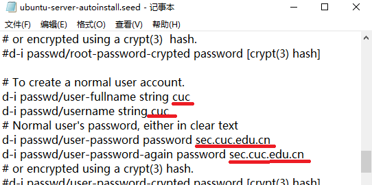
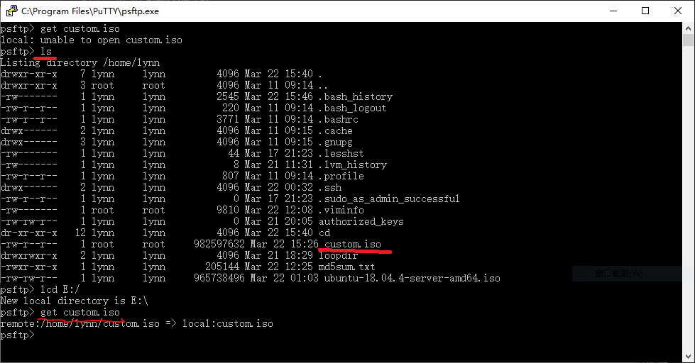
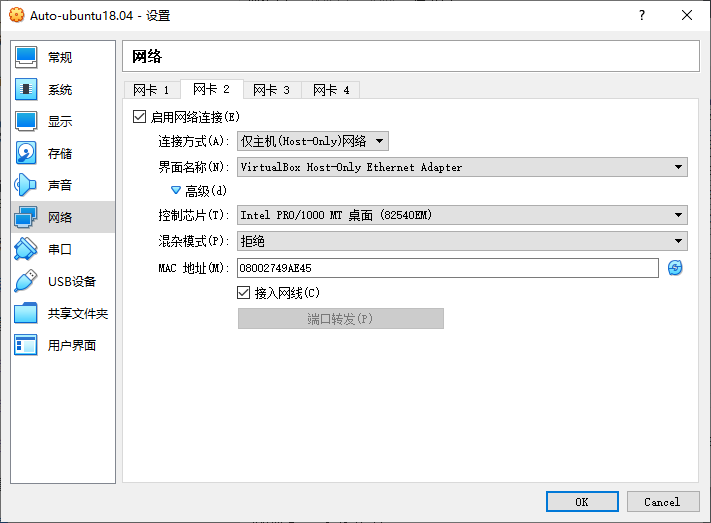
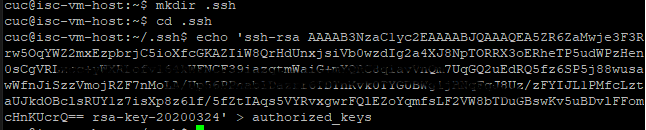
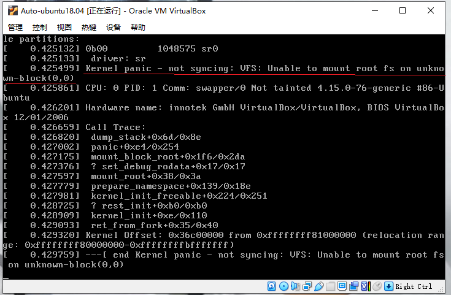

# 无人值守Linux安装镜像制作实验

## 实验环境

* Windows 10

* VirtualBox-6.1.4-Win

* Unbuntu-18.04.4-server-64bit

* 双网卡 NAT+Host-only

## 实验要求

* 如何配置无人值守安装iso并在Virtualbox中完成自动化安装.

* Virtualbox安装完Ubuntu之后新添加的网卡如何实现系统开机自动启用和自动获取IP?

* 如何使用sftp在虚拟机和宿主机之间传输文件?

## 实现特性

+ 定制一个普通用户名和默认密码

  

+ 定制安装OpenSSH Server

  

+ 安装过程禁止自动联网更新软件包

  

## 实验过程

+ 网络配置,查看网卡状态

  

+ sudo /etc/init.d/ssh start  #启用ssh 

  

+ 使用PUTTY连接虚拟机

  

+ 把用于ubuntu18.04.4镜像文件从Windows复制进虚拟机：
    
 ```markdown
    sudo mkdir loopdir #创建一个用于挂载ISO文件的目录

     sudo mount -o loop ubuntu-18.04.4-server-amd64.iso loopdir #挂载iso镜像文件到该目录

     mkdir cd  #创建一个工作目录用于克隆光盘内容

     rsync -av loopdir/ cd #同步光盘内容到目标目录-

     sudo umount loopdir #卸载镜像
```
  

+ 进入目标工作目录,编辑Ubuntu安装引导界面增加一个新菜单项入口，强制保存退出(:wq!)

```markdown
     #注意将内容置顶添加!

     label autoinstall
       menu label ^Auto Install Ubuntu Server
       kernel /install/vmlinuz
       append  file=/cdrom/preseed/ubuntu-server-autoinstall.seed debian-installer/locale=en_US console-setup/layoutcode=us keyboard-configuration/layoutcode=us console-setup/ask_detect=false localechooser/translation/warn-light=true localechooser/translation/warn-severe=true initrd=/install/initrd.gz root=/dev/ram rw quiet   
```   

  

  

+ 提前阅读并编辑定制Ubuntu官方提供的示例preseed.cfg，并将该文件保存到刚才创建的工作目录

```markdown
     ~/cd/preseed/ubuntu-server-autoinstall.seed

     #通过psftp将下载保存的.seed文件先上传到虚拟机根目录下，再移动到~/cd/preseed/，注意移动指令在根目录下，需要切换目录
```

  

  

+ 在cd目录下修改isolinux/isolinux.cfg，增加内容timeout 10

```markdown
     sudo vi isolinux/isolinux.cfg
```

  

+ 重新生成md5sum.txt  
     
    #由于一直拒绝访问，sudo su进入到root权限

  

+ 封闭改动后的目录到.iso   

```markdown
     #错误信息：无 mkisofs 命令(提示安装genisoimage)

     #查找并安装相应的软件包
     apt-cache search mkisofs
     sudo apt install genisoimage
```

  

  

+ 镜像制作完成(生成了custom.iso），使用PSFTP传入宿主机

```markdown
     #先将cd目录下镜像文件移至虚拟机默认目录下
     sudo mv custom.iso /home/lynn/
    
     #通过ls查看到远程文件列表，lcd改变本地目录避免unable to open问题 
```     

  

  

  

+ 在VirtualBox上完成自动安装

  

  

  

## 网络配置

- Virtualbox安装完Ubuntu之后新添加的网卡如何实现系统开机自动启用和自动获取IP?

```markdown
     1.添加Host-only网卡

     2.sudo vi /etc/netplan/01-netcfg.yaml #修改配置文件

     3.sudo netplan apply #更新
```

  

  

  

- 如何使用sftp在虚拟机和宿主机之间传输文件?

     1.putty连接虚拟机

     2.psttp传输文件

  

  

## PUTTY 免密登录

- 打开puttygen.exe,点击Generate生成公私钥
  
  

- 存储私钥(Save private),复制公钥

- 进入虚拟机，默认目录下创建.ssh文件夹，将刚生成的公钥写入该文件夹下的authorized_keys

```markdown
     mkdir .ssh  #创建目录
     cd .ssh    #切换目录

     echo '刚才复制的public key' > authorized_keys
```

  

- 打开putty.exe , 进入'Connection'-->'Data'输入用户名

  

- 进入'Connection'-->'SSH'-->'Auth',加载刚生成并保存的私钥文件
  
  

- 'Session'输入虚拟机IP地,若将此连接存储，下次可直接登录

  

- 免密登录成功，如下图(由于对私钥设置了密码，登录时需输入私钥密码)

  

## 遇到的问题与解决方案

+ 问题一：iso镜像文件挂载失败

  

+ 解决方法：加sudo在root权限下执行后续mkdir loopdair及mount挂载镜像命令

+ 问题二：封装改动后的目录到.iso时 报错 无权限或无文件目录

  

+ 解决方法：不要进入root权限，因为缺少 /root/cd 这个目录，用sudo运行解决该问题

  

+ 问题三：开始安装时卡住，无法正常进行。如下图：

     #原因是添加内容到到txt.cfg时 append那行进行了换行 

  
  

+ 解决方法：重新操作从挂载镜像到生成custom.iso的步骤

+ 问题四：用另一个系统重新安装的时候，若在普通用户下安装genisoimage，运行封装命令会报错

     genisoimage:missing pathspec #错误信息

+ 解决方法：sudo su 进入root权限，在root权限下安装genisoimage，在用sudo运行mkisofs命令，成功，如下图：

  

  


## 参考资料

[无人值守Linux安装镜像制作](https://blog.csdn.net/qq_31989521/article/details/58600426?ops_request_misc=%257B%2522request%255Fid%2522%253A%2522158478436019724835830693%2522%252C%2522scm%2522%253A%252220140713.130056874..%2522%257D&request_id=158478436019724835830693&biz_id=0&utm_source=distribute.pc_search_result.none-task)

[往届作业1](https://github.com/CUCCS/linux-2019-LeLeF/blob/chap0x01/chap0x01VirtualBox%20%E6%97%A0%E4%BA%BA%E5%80%BC%E5%AE%88%E5%AE%89%E8%A3%85Unbuntu%E7%B3%BB%E7%BB%9F%E5%AE%9E%E9%AA%8C/chap0x01%20VirtualBox%20%E6%97%A0%E4%BA%BA%E5%80%BC%E5%AE%88%E5%AE%89%E8%A3%85Unbuntu%E7%B3%BB%E7%BB%9F%E5%AE%9E%E9%AA%8C.md)

[往届作业2](https://github.com/CUCCS/2015-linux-public-yangyisama/blob/master/Exp1/Exp1.md)

[Putty使用ssh免密登录Linux](https://blog.csdn.net/zhaoxixc/article/details/82314957)

[文件传输CSDN](https://blog.csdn.net/stark_summer/article/details/42640757?ops_request_misc=%257B%2522request%255Fid%2522%253A%2522158486382419724845030571%2522%252C%2522scm%2522%253A%252220140713.130056874..%2522%257D&request_id=158486382419724845030571&biz_id=0&utm_source=distribute.pc_search_result.none-task)