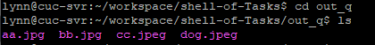

# Shell脚本编程基础实验

## 实验环境
* ubuntu 18.04 server 64bit
* PUTTY
* bash版本：` version 4.4.20(1)-release (x86_64-pc-linux-gnu)`
* imagemagick ：`Version: ImageMagick 6.9.7-4 Q16 x86_64 20170114 http://www.imagemagick.org`
## 实验内容

- [x] 课内练习：求2个数的最大公约数.要求：
    * 通过命令行参数读取2个整数，对不符合参数调用规范（使用小数、字符、少于2个参数等）的脚本执行要给出明确的错误提示信息，并退出代码执行
  
- [x] 任务一：用bash编写一个图片批处理脚本，实现以下功能：
    - [x] 支持命令行参数方式使用不同功能
    - [x] 支持对指定目录下所有支持格式的图片文件进行批处理
    - [x] 支持以下常见图片批处理功能的单独使用或组合使用
        - [x] 支持对jpeg格式图片进行图片质量压缩
        - [x] 支持对jpeg/png/svg格式图片在保持原始宽高比的前提下压缩分辨率
        - [x] 支持对图片批量添加自定义文本水印
        - [x] 支持批量重命名（统一添加文件名前缀或后缀，不影响原始文件扩展名）
        - [x] 支持将png/svg图片统一转换为jpg格式图片

- [x] 任务二：用bash编写一个文本批处理脚本，对以下附件分别进行批量处理完成相应的数据统计任务：
    * [2014世界杯运动员数据](worldcupplayerinfo.tsv)
        - [x] 统计不同年龄区间范围（20岁以下、[20-30]、30岁以上）的球员**数量**、**百分比**
        - [x] 统计不同场上位置的球员**数量**、**百分比**
        - [x] 名字最长的球员是谁？名字最短的球员是谁？
        - [x] 年龄最大的球员是谁？年龄最小的球员是谁？

- [x] 任务三：用bash编写一个文本批处理脚本，对以下附件分别进行批量处理完成相应的数据统计任务：
    * [Web服务器访问日志](web_log.tsv.7z)
        - [x] 统计访问来源主机TOP 100和分别对应出现的总次数
        - [x] 统计访问来源主机TOP 100 IP和分别对应出现的总次数
        - [x] 统计最频繁被访问的URL TOP 100
        - [x] 统计不同响应状态码的出现次数和对应百分比
        - [x] 分别统计不同4XX状态码对应的TOP 10 URL和对应出现的总次数
        - [x] 给定URL输出TOP 100访问来源主机

## 实验代码及统计数据结果

* **求两个整数的最大公约数**
    
    * [gcd.sh](Codes/gcd.sh)
    * 测试
     

* **任务一**
  
    * [image-batching.sh](Codes/image-batching.sh)
        * 原图片见文件夹 **image_for_progressing**
        * 处理后图片见文件夹 **image_after_progressing**
    * 测试：
        ```bash
         # help帮助文档
         bash image-batching.sh -h
        ```
        

        ```bash
         # 对jpeg格式图片进行图片质量压缩
         bash image-batching.sh -d images/ -q 50%
        ```
        
        
        
        ```bash
         # 对jpeg/png/svg格式图片在保持原始宽高比的前提下压缩分辨率
         bash image-batching.sh -d images/ -r 90
        ```
        
        

        ```bash
         # 对图片批量添加自定义文本水印
         bash image-batching.sh -d images/ -w "www.cnblogs.com"
        ```
        

        ```bash
         # 批量重命名（统一添加文件名前缀或后缀，不影响原始文件扩展名）
         bash image-batching.sh -d images/ -p "Pre"
         bash image-batching.sh -d images/ -s "Tail"
        ```
        
        
        

        ```bash
         # 将png/svg图片统一转换为jpg格式图片
         bash image-batching.sh -d images/ -c 100
        ```
        
        

* **任务二**
  
    * [play-data.sh](Codes/player-data.sh)
    * 测试：
        ```bash
         # help帮助文档
         bash player-data.sh -h
        ```
        


        ```bash
         #统计不同年龄区间范围（20岁以下、[20-30]、30岁以上）的球员数量、百分比
         bash player-data.sh -ar
        ```
        

        年龄区间 | 球员数量 | 百分比
        -|-|-
        (0,20) | 9 | 1.223%
        [20,30] | 600 | 81.522%
        (30, +∞) | 127 | 117.255%

        ```bash
         #统计不同场上位置的球员数量、百分比
         bash player-data.sh -p
        ```
        

        场上位置 | 球员数量 | 百分比
        -|-|-
        Midfielder | 268 | 36.413%
        Défenseur | 1 | 0.136%
        Defender | 236 | 32.165%
        Goalie | 96 | 13.043%
        Forward | 135 |  18.342%
  

        ```bash
         #统计名字最长，最短的球员
         bash player-data.sh -n
        ```
        
        
       * 名字最长：
        Francisco Javier Rodriguez
        Lazaros Christodoulopoulos
        Liassine Cadamuro-Bentaeba
       * 名字最短： Jô

        ```bash
         #统计年龄最大，最小的球员
         bash player-data.sh -ac
        ```
        

        * 年龄最大(42岁)：
        Faryd
        Mondragon
        * 年龄最小(18岁):
        Fabrice
        Olinga
        Luke
        Shaw


* **任务三**
  
    * [weblog.sh](Codes/weblog.sh)
    * 测试：
        ```bash
         # help帮助文档
         bash weblog.sh -h
        ```
        

        ```bash
         # 统计访问来源主机TOP 100和分别对应出现的总次数
         bash weblog.sh -o 100
        ```
        * 数据：[host_top.log](weblog_data/HostTop.log)

        ```bash
         # 统计访问来源主机TOP 100 IP和分别对应出现的总次数
         bash weblog.sh -i 100
        ```
        * 数据：[ip_top.log](weblog_data/IpTop.log)

        ```bash
         # 统计最频繁被访问的URL TOP 100
         bash weblog.sh -u 100
        ```
        * 数据：[url_top.log](weblog_data/UrlTop.log)

        ```bash
         # 统计不同响应状态码的出现次数和对应百分比
         bash weblog.sh -r
        ```
        * 数据：[response.log](weblog_data/Response.log)

        ```bash
         # 分别统计不同4XX状态码对应的TOP 10 URL和对应出现的总次数
         bash weblog.sh -u4 100
        ```
        * 数据：[response_4xx_top.log](weblog_data/Response4xxTop.log)

        ```bash
         # 给定URL输出TOP 100访问来源主机,例给定URL"ksc.html"
         bash weblog.sh -uh  "ksc.html" 100
        ```
        * 数据：[specified_url_host.log](weblog_data/SpecifiedURLHost.log)

## 遇到的问题

* 添加水印、压缩分辨率时出错(都是细节bug)
 
 

   解决：`bash -x`调试运行 发现convert语句中`./out_w/`误少打一个斜杠
      给ResolutionCompress函数传参的时候两个参数之间忘打空格
    ```bash
    convert "$img" -gravity southeast -fill red -pointsize 16 -draw "text 5,5 '$watermark_text'" ./out_w/"$filename"."$typename"
    ```

* 执行`bash weblog.sh -u4 100` 时卡住，无结果输出也无报错信息
  

  解决：调试模式运行`bash -x weblog.sh -u4 100`发现一条awk语句少了个参数，添加后成功执行
  
* git push报错error: failed to push some refs to 'xxx.com:

  解决方法参考[here](https://blog.csdn.net/smile__1/article/details/103340374)

* 有一次错误地将.travis.yml文件commit并push到`master`,后来再修改`chap0x04`分支的.travis.yml文件时发现合并发生冲突，报错:
  ```bash
  Failing back to patching base and 3-way merge....
  Auto-merging .travis.yml
  CONFLICT (content) : Merge conflict in .travis.yml
  error: Failed to merge in the change`
  ```
   解决：原因是`master`在`chap0x04`创建后发生了修改,删除并重建`chap0x04`分支
  
* `shellcheck`提示`Double quote to prevent globbing and word splitting.`  不太清楚原因
  
  
## 参考资料

* [运动员和weblog数据来源]([sec.cuc.edu.cn/chap0x04](http://sec.cuc.edu.cn/huangwei/course/LinuxSysAdmin/exp/chap0x04))
* [2015-linux-public-JuliBeacon](https://github.com/CUCCS/2015-linux-public-JuliBeacon/blob/524f60f68f2315623231db132df03313ab3df72a/%E5%AE%9E%E9%AA%8C%204/%E5%AE%9E%E9%AA%8C4.md)
* [linux-2019-Orange33](https://github.com/CUCCS/linux-2019-Orange33/blob/chap0x04/chap0x04/chap0x04.md)
* [ubuntu imagemagick](https://www.cnblogs.com/dylancao/p/9517168.html)
* [Linux find -regex详解](https://blog.csdn.net/mrwangwang/article/details/8790095?ops_request_misc=%257B%2522request%255Fid%2522%253A%2522158881422319724845030889%2522%252C%2522scm%2522%253A%252220140713.130102334.pc%255Fall.57675%2522%257D&request_id=158881422319724845030889&biz_id=0&utm_medium=distribute.pc_search_result.none-task-blog-2~all~first_rank_v2~rank_v25-1)
* [shell中文件后缀，目录等提取方法](https://blog.csdn.net/binggan_2019/article/details/89024460?ops_request_misc=&request_id=&biz_id=102&utm_medium=distribute.pc_search_result.none-task-blog-2~all~sobaiduweb~default-6)
* [How to Convert Images Using Linux](https://www.lifewire.com/convert-linux-command-unix-command-4097060)
* [Linux awk 命令](https://www.runoob.com/linux/linux-comm-awk.html)
* [awk的工作原理](https://man.linuxde.net/awk#awk的工作原理)
* [Linux sed 命令使用](https://blog.csdn.net/qq_37931597/article/details/86505723?ops_request_misc=%257B%2522request%255Fid%2522%253A%2522158881785319726869027256%2522%252C%2522scm%2522%253A%252220140713.130102334.pc%255Fall.57675%2522%257D&request_id=158881785319726869027256&biz_id=0&utm_medium=distribute.pc_search_result.none-task-blog-2~all~first_rank_v2~rank_v25-7)
* [使用travis-ci自动部署github上的项目](https://www.cnblogs.com/morang/p/7228488.html)
