# Web服务器实验

## 软件环境

* 测试客户端：window 10 ，IP：192.168.0.106
            Ubuntu 18.04 server 64bit，Host-Only网卡，IP：192.168.56.101

* 服务端 
  * Ubuntu 18.04 server 64bit，Host-Only网卡，IP：192.168.56.102
  * Nginx `version: nginx/1.14.0 (Ubuntu)`
  * VeryNginx
  * WordPress 4.7
  * Damn Vulnerable Web Application (DVWA)

   |   | http端口 |
   -|-|-
   | nginx | 8080 |
   | verynginx | 80 |
   | wordpress | 8181 |
   | dvwa | 5566 |

## 实验过程

#### 基本要求

 **1、在一台主机（虚拟机）上同时配置Nginx和VeryNginx**

  * 安装Nginx
    
          # 查看版本
          $ apt policy nginx
      
          # 更新可获取软件版本并安装
          $ sudo apt update && sudo apt install nginx

  * 安装VeryNginx
     参考GitHub[VeryNginx安装使用指南](https://github.com/alexazhou/VeryNginx/blob/master/readme_zh.md)
    
    * 安装相关依赖包
    
          $ apt-cache search 软件包         # 搜索软件包
          $ sudo apt install build-essential    # gcc编译器
          $ sudo apt install libssl-dev       # OpenSSL通用库
          $ sudo apt install libpcre3 libpcre3-dev     # pcre依赖库
          $ sudo apt install zlib1g-dev     # zlib依赖库
    
    * 安装VeryNginx
    
          $ git clone https://github.com/alexazhou/VeryNginx.git   #克隆仓库
          $ cd VeryNginx     #进入仓库目录
          $ sudo python3 install.py install   # 安装VeryNginx
    
      安装成功后默认在/opt/verynginx目录下

    * 修改配置文件`/opt/verynginx/openresty/nginx/conf/nginx.conf` ,`user` 修改为 `www-data`,设置 `server` 将特定IP绑定到端口，修改监听端口为 `192.168.56.102:80`
    * 启动VeryNginx服务
    
          #由于nginx监听端口也为80，启动失败，需要先关闭nginx进程
          #查看进程，获取master主进程号2388
          ps -ef | grep nginx

          #杀死Nginx进程
          sudo kill -QUIT 2388

          #启动VeryNginx服务
          $ sudo /opt/verynginx/openresty/nginx/sbin/nginx

          # 查看是否运行成功
          $ ps aux | grep nginx

      > #停止服务
        sudo /opt/verynginx/openresty/nginx/sbin/nginx -s stop
        #重启服务
        sudo /opt/verynginx/openresty/nginx/sbin/nginx -s reload

    * 修改nginx配置
      
          $ sudo vim /etc/nginx/sites-available/default
               #修改监听端口为8080
               listen 8080 default_server;
               listen [::]:8080 default_server;
           
          #启动nginx服务
          $ sudo service nginx start

        > nginx错误日志：/var/log/nginx/error.
        
    * 成功访问nginx
     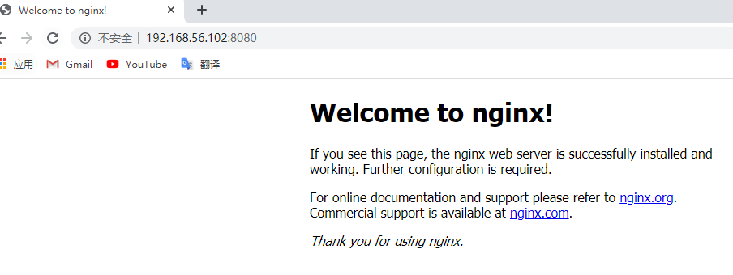
    * 成功访问verynginx
     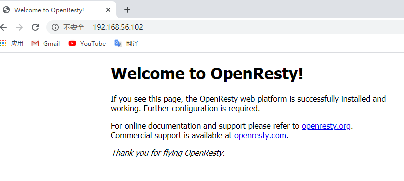
    * 登录管理页面
         ##控制台入口为`verynginx/index.html`##
       * 浏览器访问`192.168.56.102/verynginx/index.html`
       * 用户名/密码都是`verynginx/verynginx`

      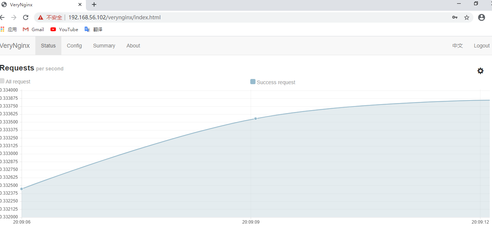

    > VeryNginx 把控制面板配置保存在 `/opt/verynginx/verynginx/configs/config.json` 里
  
    * 在测试虚拟机的/etc/hosts和本机C:\Windows\System32\drivers\etc\hosts添加以下内容`192.168.56.102 vn.sec.cuc.edu.cn`
    
  * 下载mysql用于数据管理

        #安装mysql
        $ sudo apt install mysql-server

        #检查是否正常运行，输入当前用户密码,exit退出
        $ sudo mysql -u root -p  
       安装成功：`Server version: 5.7.30-0ubuntu0.18.04.1 (Ubuntu)`      
  * PHP-FPM进程的反向代理配置在nginx服务器上

        #安装php-fpm模块及附加的帮助程序包php-mysql
        $ sudo apt install php-fpm php-mysql

        #修改nginx配置文件
        $ sudo vim /etc/nginx/sites-enabled/default
             #将下列内容取消注释
             location ~ \.php$ {
                    include snippets/fastcgi-php.conf;
                    fastcgi_pass unix:/var/run/php/php7.2-fpm.sock;
             }

        #重新启动nginx
        sudo systemctl restart nginx

 **2、使用Wordpress搭建的站点对外提供访问的地址为： http://wp.sec.cuc.edu.cn**

 参考[How To Install Linux, Nginx, MySQL, PHP (LEMP stack) on Ubuntu 18.04](https://www.digitalocean.com/community/tutorials/how-to-install-linux-nginx-mysql-php-lemp-stack-ubuntu-18-04)

  * 新建数据库用于Wordpress数据管理

        #登录mysql
        $ sudo mysql -u root -p
    ```sql
        #创建wordpress数据库
        CREATE DATABASE wordpress DEFAULT CHARACTER SET utf8mb4 COLLATE utf8mb4_unicode_ci;
        #创建wordpressuser用户
        GRANT ALL ON wordpress.* TO 'wordpressuser'@'localhost' IDENTIFIED BY 'password';
        #刷新权限
        FLUSH PRIVILEGES;
        #退出mysql
        exit；
    ```    

  * 下载php及相关拓展
  
        #安装php和相关扩展
        $ sudo apt install php-curl php-gd php-intl php-mbstring php-soap php-xml php-xmlrpc php-zip

        $ sudo systemctl restart php7.2-fpm

        # 查看版本信息
        $ php -v
    安装成功：`PHP 7.2.24-0ubuntu0.18.04.4 (cli)`

  * 安装WordPress
  
         $ cd /tmp

         # 下载实验指定版本安装包
         $ sudo wget https://wordpress.org/wordpress-4.7.zip

         $ sudo apt install unzip
         # 解压
         $ unzip wordpress-4.7.zip

         # 移动文件夹到指定目录
         $ cp /tmp/wordpress/wp-config-sample.php /tmp/wordpress/wp-config.php
         #文件备份
         $ sudo cp -a /tmp/wordpress/. /var/www/html/wordpress

         # 修改文件夹属主为 www-data
         $ sudo chown -R www-data:www-data /var/www/html/wordpress
  
  * WordPress相关配置
  
          $ sudo vim /var/www/html/wordpress/wp-config.php

              # 修改内容如下
              # 修改相关参数,注意与数据库的信息一致
              define('DB_NAME', 'wordpress');
              
              define('DB_USER', 'wordpressuser');
              
              define('DB_PASSWORD', 'password');
             
              define('DB_CHARSET', 'utf8mb4');
          
          # 创建ngnix下的配置文件
          $ sudo cp /etc/nginx/sites-available/default /etc/nginx/sites-available/wp

          $ sudo vim /etc/nginx/sites-available/wp
              # 修改监听端口
              listen 8181 default_server;
              # 修改网站根站点，为wordpress的安装目录
              root /var/www/html/wordpress;
              
              # 修改server_name
              server_name wp.sec.cuc.edu.cn
              # 添加index.php
              index index.php index.html index.htm index.nginx-debian.html;
          #语法检查    
          $ sudo nginx -t
          #建立软链接
          $ sudo ln -s /etc/nginx/sites-available/wp /etc/nginx/sites-enabled/
         
          # 重启nginx
          $ sudo systemctl restart nginx

  * 实现用域名http://wp.sec.cuc.edu.cn访问
  
        #在测试虚拟机的/etc/hosts和本机C:\Windows\System32\drivers\etc\hosts添加以下内容
        192.168.56.102 wp.sec.cuc.edu.cn
    根据引导信息完成安装后进入首页
    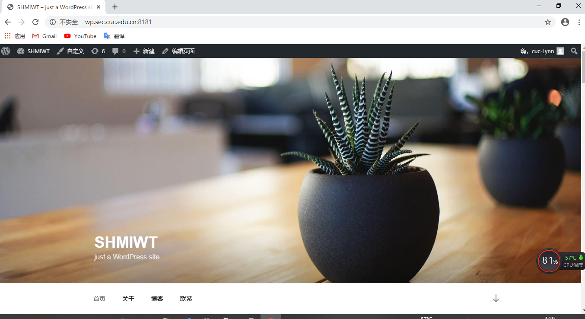

**3、使用Damn Vulnerable Web Application (DVWA)搭建的站点对外提供访问的地址为： http://dvwa.sec.cuc.edu.cn**

参考[How to Install and Configure DVWA Lab on Ubuntu 18.04 server](https://kifarunix.com/how-to-setup-damn-vulnerable-web-app-lab-on-ubuntu-18-04-server/)

  * 下载安装包
  
         $ cd /tmp
         $ git clone https://github.com/ethicalhack3r/DVWA
         $ sudo mv /tmp/DVWA /var/www/html
         $ cp config/config.inc.php.dist config/config.inc.php

         #修改文件夹属主为 www-data
         $ sudo chown -R www-data:www-data /var/www/html/DVWA

  * 建立对应数据库与用户
  
         $ sudo mysql -u root -p
      ```sql
         > CREATE DATABASE dvwa DEFAULT CHARACTER SET utf8mb4 COLLATE utf8mb4_unicode_ci;
         > GRANT ALL ON dvwa.* TO 'dvwauser'@'localhost' IDENTIFIED BY 'p@sswOrd';
         > FLUSH PRIVILEGES;
         > exit;
       ```
         #重启mysql使配置文件生效
         $ sudo systemctl restart mysql

  * 修改dvwa数据库相关和其他设置
  
         #配置数据库相关信息
         $ sudo vim /var/www/html/DVWA/config/config.inc.php 
               # 数据库相关信息如下
               $_DVWA[ 'db_server' ]   = '127.0.0.1';
               $_DVWA[ 'db_database' ] = 'dvwa';
               $_DVWA[ 'db_user' ]     = 'dvwauser';
               $_DVWA[ 'db_password' ] = 'p@ssw0rd';
        
         # 修改php相关设置
         $ sudo vim  /etc/php/7.2/fpm/php.ini

                # 修改以下内容，通过/key向下或?key向上查找关键字
                allow_url_include = On
                display_errors = Off
         
         # 重启php，使配置生效
         $ sudo systemctl restart php7.2-fpm

         # 创建ngnix下的配置文件
         $ sudo cp /etc/nginx/sites-available/wp /etc/nginx/sites-available/dvwa 

        # 修改nginx配置
        $ sudo vim /etc/nginx/sites-available/dvwa

            # 做以下修改，保存退出
            
              listen 5566 ;
              server_name  dvwa.sec.cuc.edu.cn;

              root /var/www/html/DVWA;
              index index.php index.html setup.php index.htm  index.nginx-debian.html;

        # 创建软链接
        $ sudo ln -s /etc/nginx/sites-available/dvwa /etc/nginx/sites-enabled/       

        # 重启nginx
        $ sudo systemctl restart nginx
    * 成功访问
     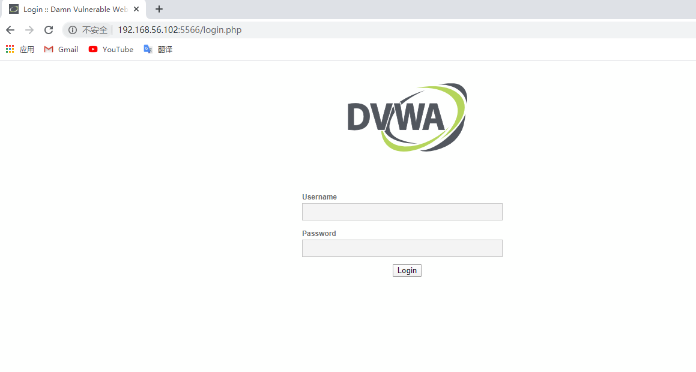
   * 实现用域名http://dvwa.sec.cuc.edu.cn访问
  
          #在测试虚拟机的/etc/hosts和本机C:\Windows\System32\drivers\etc\hosts添加以下内容
          192.168.56.102 dvwa.sec.cuc.edu.cn
      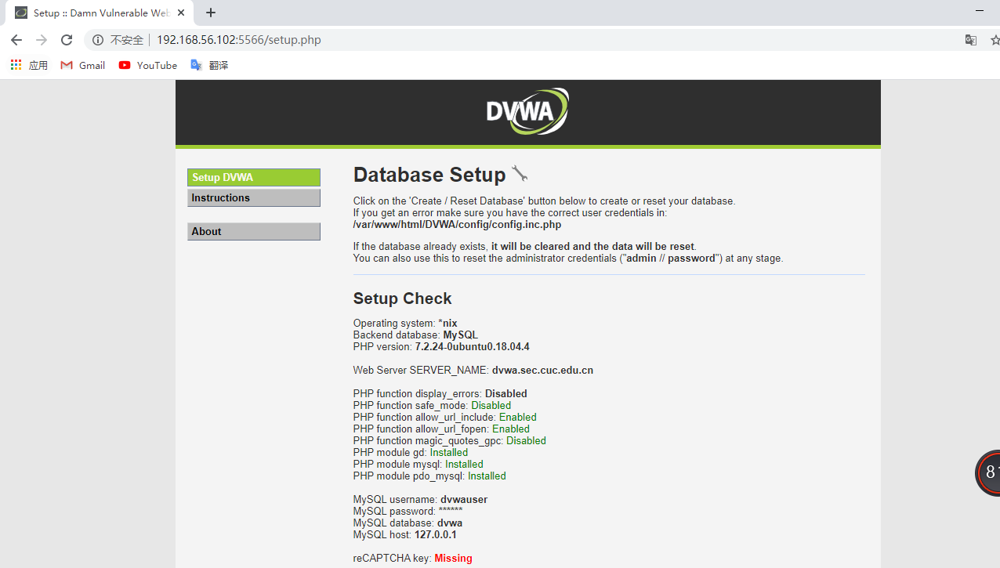

      * 点击`login.php`页面下方的`Create/Reset Database`生成需要使用的数据库。如果数据库连接成功，页面会直接重定向到登录页面，如下图，使用 `admin/password`登录。
       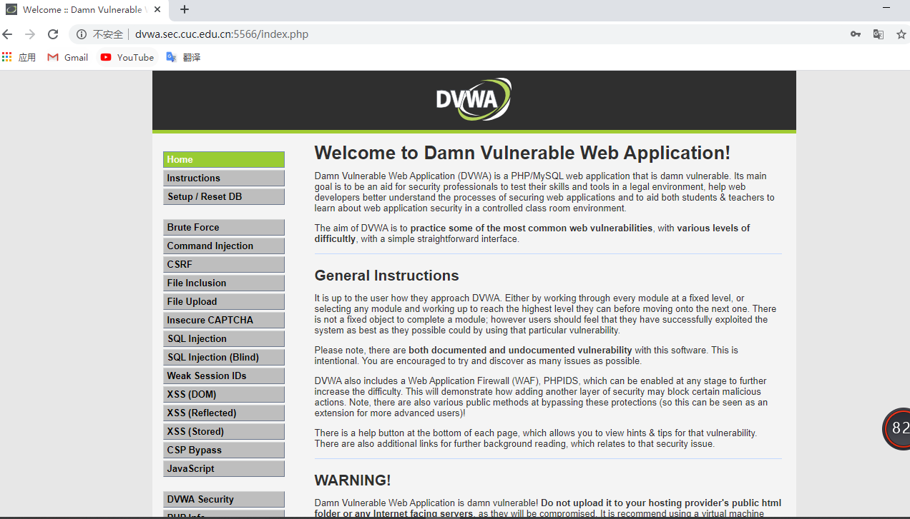

    * VeryNginx作为本次实验的Web App的反向代理服务器和WAF
      * 在verynginx中配置matcher、upstream和proxy pass
     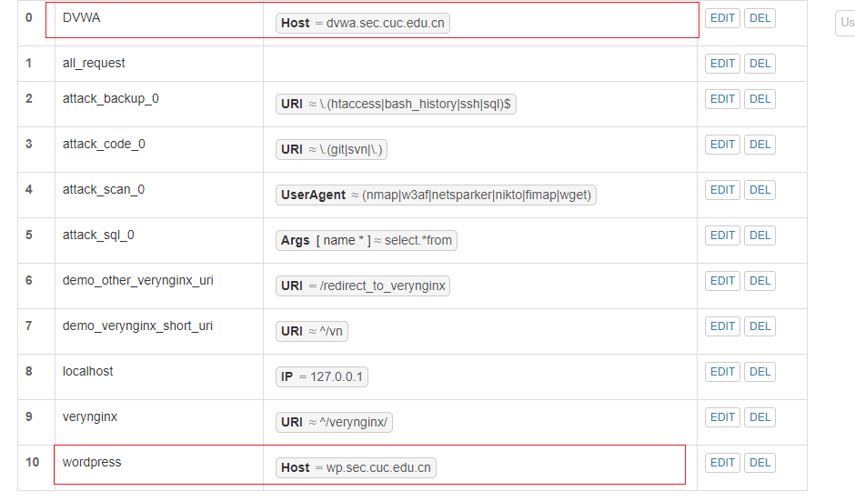
     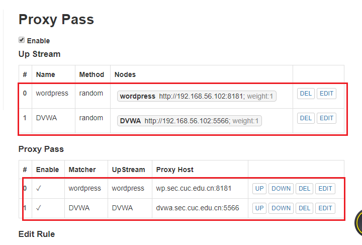

#### 安全加固要求

  * 1、使用IP地址方式均无法访问上述任意站点，并向访客展示自定义的友好错误提示信息页面-1

    * 添加matcher
     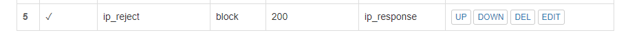
    * 添加response
     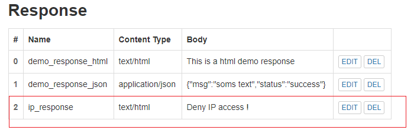
    * 添加filter
     

    * 无法通过IP访问
     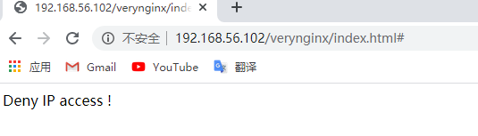

          #测试后所有IP均无法访问站点，需更改配置文件重新登陆
          $ sudo vim /opt/verynginx/verynginx/configs/config.json

          #重新加载是配置生效
          sudo /opt/verynginx/openresty/nginx/sbin/nginx -s reload

  * 2、Damn Vulnerable Web Application (DVWA)只允许白名单上的访客来源IP，其他来源的IP访问均向访客展示自定义的友好错误提示信息页面-2
  
     * 添加matcher
      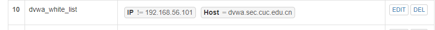
     * 添加response
      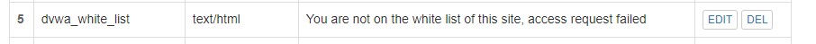
     * 添加filter
      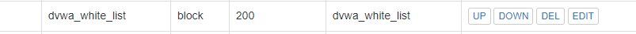

     * 在白名单中的ip访问成功
      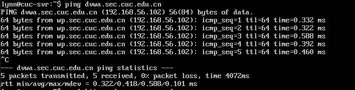
     * 未在白名单中的ip地址访问失败
      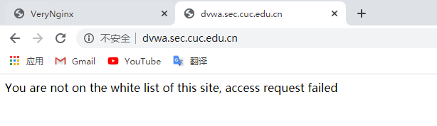

  * 3、在不升级Wordpress版本的情况下，通过定制VeryNginx的访问控制策略规则，热修复WordPress < 4.7.1 - Username Enumeration
     * 添加matcher
      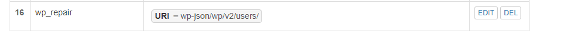
     * 添加filter
      
     * 添加后访问失败，返回404
      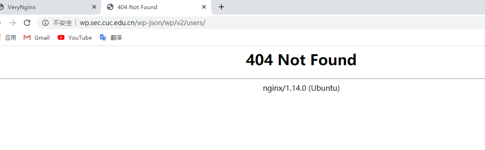

  * 4、通过配置VeryNginx的Filter规则实现对Damn Vulnerable Web Application (DVWA)的SQL注入实验在低安全等级条件下进行防护
    * 设置低安全等级
     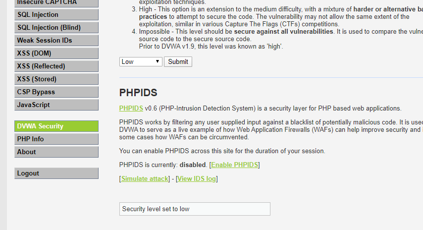
    * sql注入
     
    * 防护规则：：针对 SQL 注入常用关键词进行防护
    * 添加matcher
     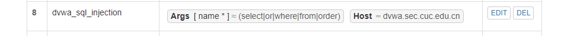
    * 添加response
     
    * 添加filter
     
    * 防护后
     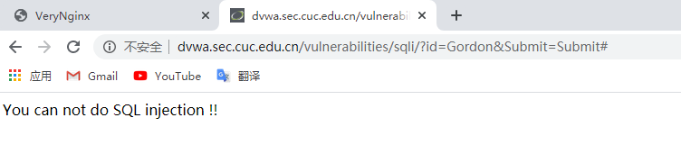

#### VeryNginx配置要求

  * VeryNginx的Web管理页面仅允许白名单上的访客来源IP，其他来源的IP访问均向访客展示自定义的友好错误提示信息页面-3

     * 添加matcher
     
     * 添加response
      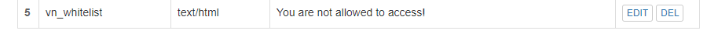
     * 添加filter
      

     * 在白名单中的ip访问成功
      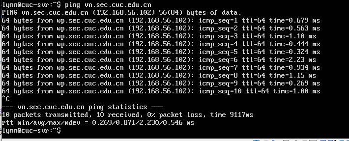
     * 未在白名单中的ip地址访问失败
      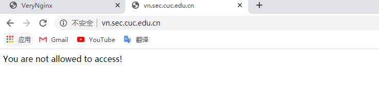

  * 通过定制VeryNginx的访问控制策略规则实现：
    * 限制DVWA站点的单IP访问速率为每秒请求数 < 50
    * 限制Wordpress站点的单IP访问速率为每秒请求数 < 20
       * 添加response
        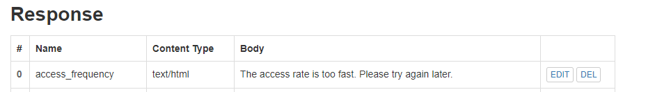
       * 添加频率限制信息
        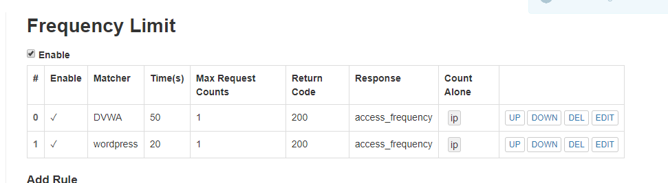
    * 超过访问频率限制的请求直接返回自定义错误提示信息页面-4
      * 实现效果
      
            # 下载包以使用ab进行测试
            $ sudo apt update
            $ sudo apt install apache2-utils 
             # 测试用命令
            $ ab -n 100 http://wp.sec.cuc.edu.cn/
            $ ab -n 100 http://dvwa.sec.cuc.edu.cn/
        
        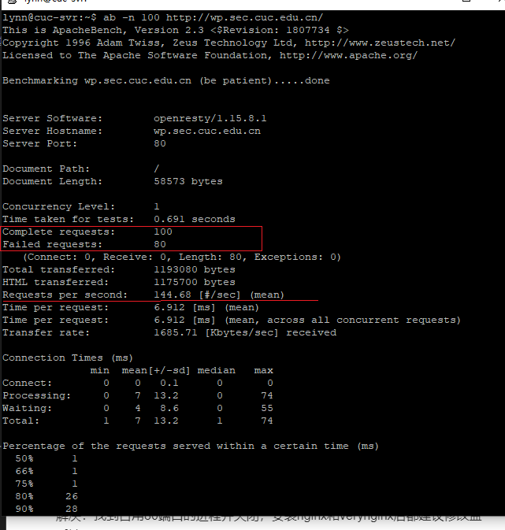
        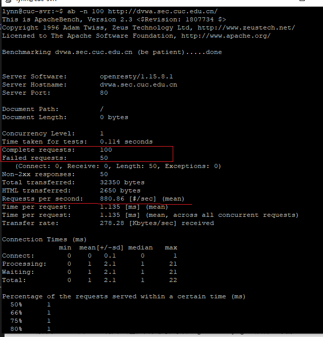
    * 禁止curl访问

      * 添加matcher
       
      * 添加response
       
      * 添加filter
       
      * curl验证
       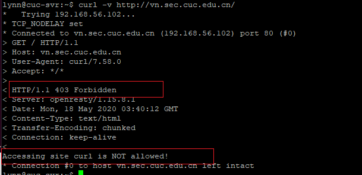

## 遇到的问题

* 1、启动nginx服务时提示端口被占用 
  解决：找到占用80端口的进程并关闭，安装nginx和verynginx后都建议修改监听端口
         
         # 查看80端口的进程列表  或用sudo lsof -i:80
         $ sudo netstat -apn|grep :80   

         # 停止apache2服务
         $sudo /etc/init.d/apache2 stop

         # 重试启动nginx服务
         $ sudo systemctl start nginx

* 2、verynginx控制面板显示不正常
  解决：使用 chrome 浏览器，排除浏览器不兼容的可能

* 3、访问相应站点时无法访问到默认设置界面,打开开发者工具查看到Remote Address并不是预想的8181端口，而是verynginx的80端口
  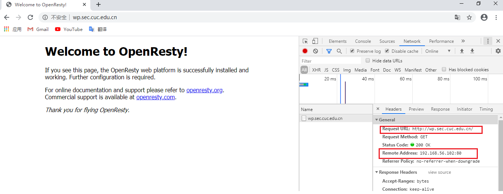
  解决：
  php-d的反向代理配置修正：
  
      fastcgi_pass unix:/var/run/php/php7.0-fpm --->fastcgi_pass unix:/var/run/php/php7.2-fpm
  加端口访问:`wp.sec.cuc.edu.cn:8181`

* 4、verynginx控制面板上的配置修改无法保存
  #nginx 进程对 /opt/verynginx/verynginx/configs/ 无写权限

  解决：执行`chmod -R 777 /opt/verynginx/verynginx/configs`

* 4、下载dvwa时Git clone速度很慢，甚至出现ping github.com失败
  解决：
  查找域名地址，修改hosts文件
  参考[git clone速度太慢的解决办法](https://www.linuxidc.com/Linux/2019-05/158461.htm)

## 参考资料

* [alexazhou/VeryNginx](https://github.com/alexazhou/VeryNginx/blob/master/readme_zh.md)
* [How To Install Linux, Nginx, MySQL, PHP (LEMP stack) on Ubuntu 18.04](https://www.digitalocean.com/community/tutorials/how-to-install-linux-nginx-mysql-php-lemp-stack-ubuntu-18-04)
* [How to Install and Configure DVWA Lab on Ubuntu 18.04 server](https://kifarunix.com/how-to-setup-damn-vulnerable-web-app-lab-on-ubuntu-18-04-server/)
* [linux-2019-jackcily](https://github.com/CUCCS/linux-2019-jackcily/blob/job5/job5/%E5%AE%9E%E9%AA%8C5.md)
* [linux-2019-Orange33](https://github.com/CUCCS/linux-2019-Orange33/blob/chap0x05/chap0x05/chap0x05.md)
* [Linux第五章课后 FAQ 新视频](https://m.bilibili.com/video/BV1de411p7Vq)