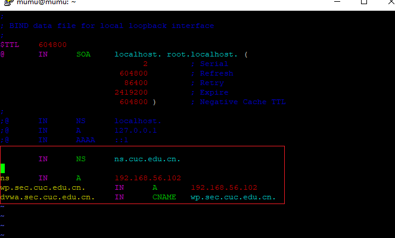
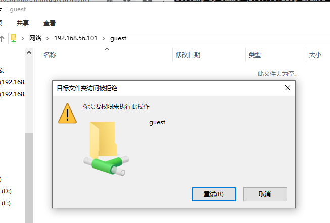
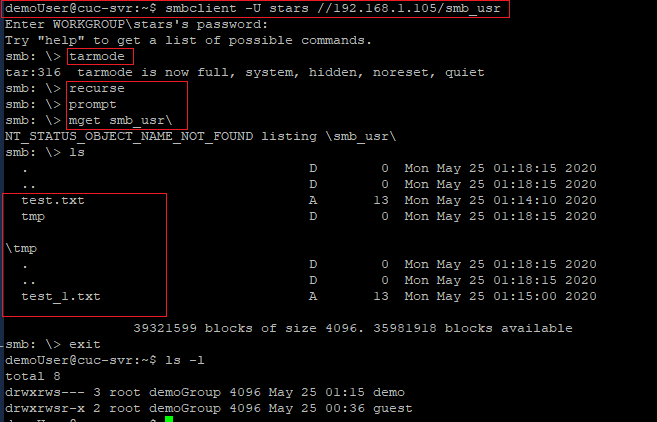

# Shell脚本编程进阶实验
 > FTP、NFS、DHCP、DNS、Samba服务器的自动安装与自动配置

## 实验环境

* ubuntu18.04 server 64bit
   * 工作主机：lynn@cuc-svr，IP：192.168.56.101
   * 目标主机：mumu@cuc-svr，IP：192.168.56.102

## 实验要求
   参照[chap0x06课件](https://c4pr1c3.github.io/LinuxSysAdmin/chap0x06.md.html#/1)、[shell脚本编程基本要求](https://c4pr1c3.github.io/LinuxSysAdmin/chap0x06.exp.md.html#/shell)
   - [x] FTP
     * 对照第6章课件中的要求选择一款合适的FTP服务器软件支持所有任务要求
   - [x] NFS
     * 对照第6章课件中的NFS服务器配置任务
   - [x] DHCP
     * 2台虚拟机使用Internal网络模式连接，其中一台虚拟机上配置DHCP服务，另一台服务器作为DHCP客户端，从该DHCP服务器获取网络地址配置
   - [x] Samba
     * 对照第6章课件中smbclient一节的3点任务要求完成Samba服务器配置和客户端配置连接测试
   - [x] DNS
     * 基于上述Internal网络模式连接的虚拟机实验环境，在DHCP服务器上配置DNS服务，使得另一台作为DNS客户端的主机可以通过该DNS服务器进行DNS查询
    在DNS服务器上添加`zone "cuc.edu.cn"` 的以下解析记录

           ns.cuc.edu.cn NS
           ns A <自行填写DNS服务器的IP地址>
           wp.sec.cuc.edu.cn A <自行填写第5章实验中配置的WEB服务器的IP地址>
           dvwa.sec.cuc.edu.cn CNAME wp.sec.cuc.edu.cn

## 实验过程

* **配置远程目标主机的SSH免密root登录**

  * 目标主机SSH配置
    * 开启ssh服务：`sudo service ssh start`
    * 修改ssh配置文件`sudo vim /etc/ssh/sshd_config`，注意保留默认配置和修改痕迹
  
          #设置可通过口令认证SSH
          PasswordAuthentication yes
          #允许root用户登录
          PermitRootLogin yes
    
    * 重启ssh服务`sudo systemctl restart ssh`
    * 给root用户设置密码：`sudo passwd`
  
  * 工作主机生成秘钥
        
         #生成一对公私钥,foo为文件名
         $ ssh-keygen -f .ssh/foo

         #将公钥传输至目标主机authorized_keys文件
         $ ssh-copy-id -i ~/.ssh/foo root@192.168.56.102
      
         #测试秘钥(此时需要输入root密码)
         $ ssh root@192.168.56.102

  * 设置免密登录
    * 取消root口令并禁用口令登录
         
          #修改目标主机配置文件
          $ sudo vim /etc/ssh/sshd_config
               PasswordAuthentication no
               PermitRootLogin without-password

          #重启ssh服务
          $ sudo systemctl restart ssh

  * root免密登录：`ssh -i ~/.ssh/foo root@192.168.56.102`
   

* **FTP**
  * 服务器选择：vsftpd
  * 脚本文件：[vsftpd.sh](scripts/vsftpd.sh)
  * 配置文件：[/etc/vsftpd.conf](configs/vsftpd.conf)
  * 通过工作主机运行脚本在目标主机安装vsftpd并完成相关配置
  
    * 将脚本文件`vsftpd.sh`拷贝到目标主机：`scp -i .ssh/foo workspace/shell/vsftpd.sh root@192.168.56.102:workspace/`
    

    * 借助SSH的远程命令执行功能实现目标主机控制安装和配置：`ssh -i .ssh/foo root@192.168.56.102 'bash workspace/vsftpd.sh'`
    

  * 配置一个提供匿名访问的FTP服务器，匿名访问者可以访问1个目录且仅拥有该目录及其所有子目录的只读访问权限
   

  * 配置一个支持用户名和密码方式访问的账号，该账号继承匿名访问者所有权限，且拥有对另1个独立目录及其子目录完整读写（包括创建目录、修改文件、删除文件等）权限
  
    * 用户名密码登录
     

    * 在poggio用户的目录下出现了匿名用户目录下的文件，可证明继承匿名者访问权限
     

    * 删除文件、创建目录、修改文件
     

    * FTP用户不能越权访问指定目录之外的任意其他目录和文件（注意：不是通过 绝对路径 方式来遍历，而是验证通过 相对路径 （例如 cd ../../../../ ）方式无法翻出 FTP 服务器指定的当前用户的 家目录 访问到 家目录及其所有子目录 以外的任何其他目录）
     

    * 匿名访问权限仅限白名单IP来源用户访问，禁止白名单IP以外的访问
     

  * 参考
    * [vsftpd](https://security.appspot.com/vsftpd.html)
    * [FTP Server && vsftpd-FTP Server](https://ubuntu.com/server/docs/service-ftp)

* **NFS**
  * 脚本文件
    * [nfs_srv.sh](scripts/nfs_srv.sh)
    * [nfs_clt.sh](scripts/nfs_clt.sh)
  * 配置文件
    * [/etc/exports](configs/exports)
  
  * 将nfs_srv.sh拷贝到目标主机，工作主机运行nfs_srv.sh脚本
   `scp -i .ssh/foo workspace/shell/nfs_srv.sh root@192.168.56.102:workspace/`、
   `ssh -i .ssh/foo root@192.168.56.102 'bash workspace/nfs_srv.sh'`

        #在目标主机通过进程查看nfs服务是否运行
         ps -aux|grep -v grep|grep nfs
         
  * 工作主机运行nfs_clt.sh脚本 `bash nfs_clt.sh`
  * 在1台Linux上配置NFS服务，另1台电脑上配置NFS客户端挂载2个权限不同的共享目录，分别对应只读访问和读写访问权限
    * 创建的两个目录分别为:只读`/nfs/gen_r`和读写`/nfs/gen_rw`
      
      

    * 两个共享文件目录对应只读和读写访问权限
     

  * 客户端共享目录中文件、子目录的属主、权限信息和在NFS服务器端的信息,uid和gid一致
    * client
      
    * server
      

  * 参照资料
    > By default, NFS translates requests from a root user remotely into a non-privileged user on the server. This was intended as security feature to prevent a root account on the client from using the file system of the host as root. no_root_squash disables this behavior for certain shares.

     * 添加两个/home下的共享目录，分别设置`no_root_squash`和不设置`no_root_squash`
  
     * 对于设置了no_root_squash的共享目录
      
      

     * 对于没有设置no_root_squash的共享目录，无法在工作主机(client)写入文件，创建目录
      
      
  
  * 参考[how-to-set-up-an-nfs-mount-on-ubuntu-18-04](https://www.digitalocean.com/community/tutorials/how-to-set-up-an-nfs-mount-on-ubuntu-18-04)

* **DHCP**
  * 脚本文件 [dhcp.sh](scripts/dhcp.sh)
  * 配置文件 
    * [/etc/dhcp/dhcpd.conf](configs/dhcpd.conf)
    * [/etc/default/isc-dhcp-server](configs/isc-dhcp-server)
  
  * 2台虚拟机使用Internal网络模式连接，其中一台虚拟机上配置DHCP服务，另一台服务器作为DHCP客户端，从该DHCP服务器获取网络地址配置
   > Internal模式:内网模式，即虚拟机与外网完全断开，只实现虚拟机于虚拟机之间的内部网络模式。
  
    * 先将两台虚拟机增加网卡为`内部网络`网络模式,`client`:工作主机；`server`:目标主机
      * 注意界面名称必须一致
      
      
  
    * server配置
      * 通过`scp`将脚本`dhcp.sh`拷贝到目标主机，通过`ssh`方式远程执行脚本
      * 查看server配置文件
        
            $ less /etc/netplan/01-netcfg.yaml

             network:
               version: 2
               renderer: networkd
               ethernets:
                 enp0s3:
                   dhcp4: yes
               enp0s8:
                 dhcp4: yes
               enp0s9:
                 #必须静态配置
                 dhcp4: no
                 addresses: [192.168.57.1/24]

    * client配置
      * 修改配置文件`/etc/netplan/01-netcfg.yaml`，添加`enp0s9`,设置`dhcp4: yes`
      * `sudo netplan apply`使配置生效
      * 查看client配置文件
            $ less /etc/netplan/01-netcfg.yaml

             network:
               version: 2
               renderer: networkd
               ethernets:
                 enp0s3:
                   dhcp4: yes
                 enp0s8:
                   dhcp4: yes
                 enp0s9:
                   dhcp4: yes
    
    * 实验结果
    
    
    
  * 参考[isc-dhcp-server](https://help.ubuntu.com/community/isc-dhcp-server)

* **DNS**
  * 基于上述Internal网络模式连接的虚拟机实验环境，在DHCP服务器上配置DNS服务，使得另一台作为DNS客户端的主机可以通过该DNS服务器进行DNS查询
  * 在DNS服务器上添加 zone "cuc.edu.cn" 的解析记录
  
  * 配置文件：
     * [/etc/bind/named.conf.options](configs/named.conf.options)
     * [/etc/bind/named.conf.local](configs/named.conf.local)
     * [/etc/bind/db.cuc.edu.cn](configs/db.cuc.edu.cn)
  
  * server
  
    * 安装bind9：`sudo apt update && sudo apt install bind9`
    * 修改配置文件`sudo vim /etc/bind/named.conf.options`
           
          #在options选项中添加以下配置
          listen-on { 192.168.56.102; };  # ns1 private IP address - listen on private network only
          allow-transfer { none; }; # disable zone transfers by default
          forwarders {
             8.8.8.8;
              8.8.4.4;
          };
    * 编辑配置文件`sudo vim /etc/bind/named.conf.local`

          #添加如下配置
          zone "cuc.edu.cn" {
              type master;
              file "/etc/bind/db.cuc.edu.cn";
          };
    * 生成配置文件`db.cuc.edu.cn`
  
          $ sudo cp /etc/bind/db.local /etc/bind/db.cuc.edu.cn
    * 编辑配置文件`sudo vim /etc/bind/db.cuc.edu.cn`
     
    * 重启bind9：`sudo service bind9 restart`
  
  * client
     * 安装resolvconf：`sudo apt update && sudo apt install resolvconf`
     
     * 修改配置文件：`sudo vim /etc/resolvconf/resolv.conf.d/head`

            #添加配置
            search cuc.edu.cn
            nameserver 192.168.57.1
      * sudo resolvconf -u
  * 测试结果：
    
    

  * 参考[DNS_Service](https://ubuntu.com/server/docs/service-domain-name-service-dns)

* **Samba**
  
  * **在windows 10客户端上连接Linux上的Samba服务器**
    * 脚本文件 [smb_srv.sh](scripts/smb_srv.sh)
    * 配置文件 [/etc/samba/smb.conf](configs/smb.conf)

    * 执行脚本smb_srv.sh
    > 配置文件目录：`/etc/samba/smb.conf`
    > 服务启动\停止\重启等命令：`/etc/init.d/smbd {start|stop|reload|restart|force-reload|status}`

    * 打开资源管理器，右键“此电脑”，选择“添加一个网络位置”
    * 输入共享文件夹路径
    
    

    * 访问匿名目录，不用输入账号密码，且不可以创建文件夹
    

    * 访问指定用户文件夹，需要输入账号密码，且可以创建文件夹，(注：此处的账号密码是之前配置过的samba用户与密码)
    
    
  
  * **在Linux上连接Windows10上的服务器**
  > sudo apt install smbclient
     
    * Windows设置共享目录---参考[linux-public-JuliBeacon](https://github.com/CUCCS/2015-linux-public-JuliBeacon/blob/exp6/%E5%AE%9E%E9%AA%8C%206/%E5%9C%A8Linux%E5%92%8CWindows%E9%97%B4%E8%AE%BE%E7%BD%AE%E6%96%87%E4%BB%B6%E5%85%B1%E4%BA%AB.md)
  
      * 结果：账号密码登录共享目录`smb_usr`的用户为`stars` ，匿名登录共享目录`smb_anon`的用户为`Everyone`
        
        

    * Linux访问Windows的匿名共享目录
     

    * Linux访问Windows的用户名密码方式共享目录
     

    * 下载整个目录
     
  
  * 参考
    * [how-to-share-files-between-windows-and-linux](https://www.howtogeek.com/176471/how-to-share-files-between-windows-and-linux/)
    * [getting-whole-folder-using-smbclient](https://indradjy.wordpress.com/2010/04/14/getting-whole-folder-using-smbclient/)

  
## 遇到的问题

* 1、设置root免密登录时 报错`root@192.168.56.102: Permission denied (publickey).`,尝试修改文件权限,或参照[ToubleShooting](https://help.ubuntu.com/community/SSH/OpenSSH/Keys#Troubleshooting)新建目录等方法都未解决，如下：
  
  解决：后来不执行[参考教程](https://askubuntu.com/questions/115151/how-to-set-up-passwordless-ssh-access-for-root-user)中锁定root用户密码的步骤，就成功了。虽然免密登录成功，但还不太清楚报错的原因

* 2、apt install时报错如下，原因是apt安装依赖时并非静默安装，需要交互，所以无法正常通过
 
 解决：
      修改Dockerfile文件，添加一行内容：`ENV DEBIAN_FRONTEND noninteractive`

* 3、ftpd 连接时报错`421 service not available`
  

      #查看服务vsftpd是否开启
      $ sudo systemctl status vsftpd
      #查看防火墙状态
      $ sudo ufw status
          #关闭状态
          Status: inactive
      #查看日志
      $ less /var/log/vsftpd.log
         #错误信息
         Sat May 23 21:34:18 2020 [pid 7288] CONNECT: Client "::1", "Connection refused: tcp_wrappers denial."
      #查看/etc/hosts.deny
          vsftpd: ALL
  后来换成`ftp 127.0.0.1`连接

* 4、Smaba无法查看Windows共享目录，报错如下：
  
     

  解决方法:
    * `WARNING: The "syslog" option is deprecated`问题可通过修改配置文件``注释掉`syslog=0`这一行，参考[警告"syslog"选项已经过时](https://www.helplib.com/c/mutia_163819)
    * `Connectipn failed`问题是因为lynn用户并不在用户组里，应该`su demoUser`切换到samba用户demoUser执行shell命令
      * 此时报错`This account is currently not available`,查看`/etc/passwd`文件发现此用户的shell是`/sbin/nologin`,应修改为`/bin/bash`

## 参考资料

* [how-to-set-up-passwordless-ssh-access-for-root-user](https://askubuntu.com/questions/115151/how-to-set-up-passwordless-ssh-access-for-root-user)
* [evaluating-ftp-servers-proftpd-vs-pureftpd-vs-vsftpd](https://systembash.com/evaluating-ftp-servers-proftpd-vs-pureftpd-vs-vsftpd/)

* [linux-2019-luyj](https://github.com/CUCCS/linux-2019-luyj/blob/Linux_exp0x06/Linux_exp0x06/Linux_exp0x06.md)
* [2015-linux-public-JuliBeacon](https://github.com/CUCCS/2015-linux-public-JuliBeacon/blob/exp6/%E5%AE%9E%E9%AA%8C%206/%E5%AE%9E%E9%AA%8C6.md)
* [2015-linux-public-JuliBeacon/pull/5/](https://github.com/CUCCS/2015-linux-public-JuliBeacon/pull/5/commits/48ad79ff47cd96a9d9990a38796556183cb49b19)
